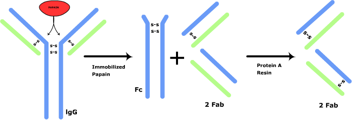
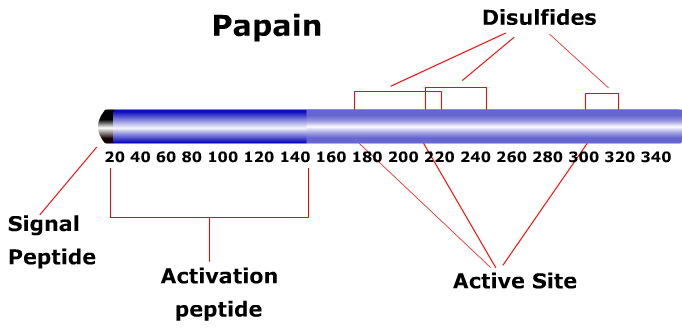

### Principle:
 
&nbsp;
 

Antibodies pervade almost every tissue and fluid in our body. Functionally antibodies can be characterized by their ability to bind both to antigens and to specialized cells or proteins of the immune system. Structurally antibodies are composed of one or more copies of a characteristic unit that can be visualized as forming a Y-shape. Each Y contains four polypeptides. Two identical copies of a polypeptide called the light chain. Antibodies are divided into five classes – IgG, IgM, IgA, IgE and IgD on the basis of the number of Y-like units and the type of heavy chain polypeptide they contain.
 

  
&nbsp;

#### IgG Antibodies
 

The important structural features of antibodies are easiest to understand by considering IgG antibodies which contain only one structural unit and also most abundant in serum. About 75% of all immunoglobulins in our body are IgG. Compared to the other classes of immunoglobulin it is small and light weighing in at about 146 kilodaltons. Its heavy chains are called gamma heavy chains and contain very little carbohydrate (about 3%).
 

 
&nbsp;
 

IgG molecules have three protein domains. Two of the domains are identical and form the arms of the Y. Each arm contains a site that can bind to an antigen making IgG molecules bivalent. The third domain forms the base of the Y and this region is important in certain aspects of the immune response. The three domains may be separated from each other by cleavage with protease Papain. The two domains that carry the antigen binding sites are known as F(ab) fragments (named for the fragment having the antigen binding site) and the protein domain that is involved in immune regulation is termed as Fc fragment (for the fragment that crystallizes). The region between the F(ab)and Fc  fragments is called the hinge. This segment allows lateral and rotational movement of the two antigen binding domains.

 
&nbsp;

 
&nbsp;

The two heavy chain polypeptides in the Y structure are identical and are approximately 55000 daltons.The two light chains are also identical and are about 25000 daltons. One light chain associates with the anmino terminal region of one heavy chain to form an antigen binding domain.The carboxy terminal region of the two heavy chains fold together to make the Fc domain. The two polypeptide chains are held together by disulfide bridges and non-covalent bonds.
 

 
&nbsp;
 

#### Cleavage of IgG using Proteolytic Enzymes
 

The structural aspects of antibodies using Proteolytic enzymes such as Papain and pepsin were extensively studied by porter (1959) and Nisonoff.et.al (1960). The protein specific enzymes break the covalent peptide bond between two amino acid residues in the polypeptide chain, each enzyme having a special preference for a particular residue or residues.  Enzymes commonly used are Papain isolated from the latex of the papaya tree “Carcia papaya“ and pepsin isolated from stomach juice.
 
 
&nbsp;

 

Papain splits the immunoglobulin molecule into three pieces of equal size. Thus two of these pieces are identical and are able to bind antigen, the third piece is different and is not capable of antigen binding. The former is the Fab pieces (Fab- Fragment antigen binding) and later is Fc piece (Fc-Fragment crystalline) because it can be crystallized from a solution as a homogenous substance, Fab prepared from a pool of serum IgG molecules cannot be crystallized because they are such a heterogeneous bunch.
 
 
&nbsp;

 

The fragments obtained by the Proteolytic cleavage of antibodies can be further subjected to chemical treatment yields smaller fragments. For example the treatment of Fab fragment with 2-Mercaptoethanol yields two smaller fragments one which is the L-chain while the other slightly larger than the L-chain. Also the prolonged treatment of Fc fragment with Papain cleaves this fragment further to produce Fc. By special chemical treatment it is also able to produce Fv fragments which consists of the VH  and VL domains held together by noncovalent bonds.
 
 &nbsp;

 
&nbsp;

 

 
#### Papain:
 
Papain is a cysteine protease of the peptidase C1 family. Papain consists of a single polypeptide chain with three disulfide bridges and a sulfhydryl group necessary for activity of the enzyme. Papain cleaves immunoglobulin G molecules in the hinge reason which results in the generation of three ~50kDa fragments; two Fab domains and a Fc domain.  The Papain-digested antibody is unable to promote agglutination, precipitation, opsonization, and lysis.

  
&nbsp;

**Physical Properties and Kinetics**
 
 
&nbsp;

Molecular weight: 23,406 Da (amino acid sequence)

Optimal pH for activity: 6.0-7.0

Temperature Optimum for Activity: 65 °C

pI: 8.75 ; 9.55
 
 
&nbsp;

**Spectral properties:**
 
 
&nbsp;

λmax: 278 nm 19

Extinction coefficient, E1% = 25

Extinction coefficient, EmM = 57.6 (at 280 nm)
 

 
&nbsp;
 

**Solubility and Solution Stability**
 
&nbsp;

 

Papain is soluble in water at 10 mg/ml. The enzyme is typically diluted in buffer containing ~5 mM L-cysteine immediately before its usage. Activation/stabilizing agents include EDTA, cysteine, and dimercaptopropanol. Although Papain solutions have good temperature stability, the solution stability is pH dependent. Papain solutions are unstable under acidic conditions, i.e., at pH values below 2.8, there is a significant loss in activity.
 
&nbsp;

 
&nbsp;

 

A common inactive form of Papain obtained during isolation is a mixed disulfide formed between the active site sulfhydryl group of the protein and free cysteine. Papain solutions are stable to several denaturing agents, i.e., full activity is maintained after recrystallization in 70% methanol and in 8 M urea solutions. However, there is a significant loss in activity when Papain is exposed to 10% trichloroacetic acid or to 6 M guanidine hydrochloride.
 

  
&nbsp;

**Specificity**
 
&nbsp;
 

Papain will digest most protein substrates more extensively than the pancreatic proteases. Papain exhibits broad specificity, cleaving peptide bonds of basic amino acids, leucine, or glycine. It also hydrolyzes esters and amides. Papain exhibits a preference for an amino acid bearing a large hydrophobic side chain at the P2 position. It does not accept Val at the P1 position.

  
&nbsp;

#### Applications of  Papain

Papain is commonly used in cell isolation procedures where it has proven more efficient and less destructive than other proteases on certain tissues.

 
&nbsp;
 

1. Papain digestion has proven useful for structural studies of enzymes and other proteins. Papain is used in red cell serology to modify the red cell surface to enhance or destroy the reactivity of many red cell antigens as an adjunct to grouping, antibody screening, or antibody identification procedures.
2. Papain has also been shown to be useful in platelet serology.
3. Papain has also been used in the enzymatic synthesis of amino acids, peptides, and other molecules.
4. Fab  antibody fragments are used in assay systems where the presence of the Fc region may cause problems. In these cases it is preferable to use only the antigen binding (Fab) portion of an antibody.
  
&nbsp;

#### Why antibodies are fragmented?

Proteolytic cleavage of antibodies results in defined antibody fragments. The analysis of antibody fragments offers several advantages over intact antibodies. Some of the advantages of  antibody fragments are:

 
&nbsp;

 

1. Fab Fragments are useful in histochemical studies because the fragments penetrate the tissue better than IgG.
2. Fab regions are used for the antigen-antibody binding studies without the interference from the non-antigen binding fragment (Fc region) and simplifies the characterization of MAb variants.
3. In tissues such as lymph nodes or spleen, or in peripheral blood preparations, cells with Fc receptors (macrophages, monocytes, B lymphocytes, and natural killer cells) are present which can bind the Fc region of intact antibodies, causing background staining in areas that do not contain the target antigen. Use of Fab fragments ensures that the antibodies are binding to the antigen and not to Fc receptors. Fab fragments allow more exact localization of the target antigen, i.e. in staining tissue for electron microscopy.
4. The three dimensional structure of antibodies can be studied using these fragments such as Fab and Fc.
5. The antigen binding fragment, Fab can be used to treat poisoning with Digoxin and other potent low formulae mass poisons such as colchicine and tricyclic antidepressant.
6. The monovalent Fab fragment generated by Proteolytic cleavage  can be used to block endogenous immunoglobulin  on cells, tissues or other surfaces. Also it blocks the exposed  immunoglobulin’s in multiple labeling experiments using preliminary antibodies from the same species.
 
